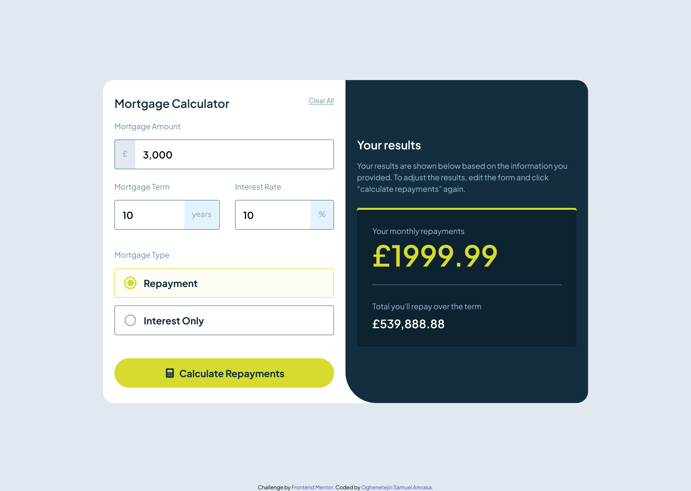

# Frontend Mentor - Mortgage repayment calculator solution

This is a solution to the [Mortgage repayment calculator challenge on Frontend Mentor](https://www.frontendmentor.io/challenges/mortgage-repayment-calculator-Galx1LXK73). Frontend Mentor challenges help you improve your coding skills by building realistic projects.

## Table of contents

- [Overview](#overview)
  - [The challenge](#the-challenge)
  - [Screenshot](#screenshot)
  - [Links](#links)
  - [How to install](#Install-instructions)
- [My process](#my-process)
  - [Built with](#built-with)
  - [What I learned](#what-i-learned)
  - [Continued development](#continued-development)
  - [Useful resources](#useful-resources)
- [Author](#author)

## Overview

### The challenge

Users should be able to:

- Input mortgage information and see monthly repayment and total repayment amounts after submitting the form
- See form validation messages if any field is incomplete
- Complete the form only using their keyboard
- View the optimal layout for the interface depending on their device's screen size
- See hover and focus states for all interactive elements on the page

### Screenshot



### Links

- Solution URL: [Add solution URL here](https://your-solution-url.com)
- Live Site URL: [Add live site URL here](https://your-live-site-url.com)

### Install-instructions

To install dependencies run:

```
npm install
```

To start the dev server (which can also be opened on devices connected to the same network) run:

```
npm run dev -- --host
```

## My process

### Built with

- Semantic HTML5 markup
- Tailwindcss
- Flexbox
- CSS Grid
- Mobile-first workflow
- Javascript
- [Vite](https://vite.dev/) - Dev and build tools

### What I learned

I learned how to prevent users from entering non-numerical values in javascript using the combination of 'keyup' event listener and regular expressions

```js
if (!/[0-9]|Backspace|Delete|ArrowLeft|ArrowRight|Tab/.test(e.key)) {
  e.preventDefault();
}
```

I also learned how to apply international number format on user entered digits in the textbox and how to remove the formatting when the text box's value is retrieved for calculation

- Application of international number format

```js
setTimeout(() => {
  let value = mortgageAmount.value.replace(/\D/g, "");
  if (value) {
    value = new Intl.NumberFormat("en-GB").format(Number(value));
    mortgageAmount.value = value;
  }
}, 0);
```

- Removal of formatting ahead of calculation

```js
const principal = +mortgageAmount.value.replace(/,/g, "");
```

I also learned to use the isolation property to reset the stacking context in order for z-indexes to work as expected.

```html
<div
  class="flex-1/2 bg-[color:hsl(201,54%,16%)] grid place-items-center px-6 py-8 md:rounded-tr-3xl md:rounded-br-3xl md:rounded-bl-[4rem] isolate"
  id="results"
>
  <!-- empty results start -->
  <div class="hidden flex-col items-center gap-4" id="empty">
    
    <h1 class="text-2xl text-white font-bold">Results shown here</h1>
    <p class="text-center text-slate-300">
      Complete the form and click “calculate repayments” to see what your
      monthly repayments would be.
    </p>
  </div>
  <!-- empty results end -->

  <!-- completed results start -->
  <div class="flex flex-col" id="completed">
    <h1 class="text-2xl text-white font-semibold md:mb-4">Your results</h1>
    <p class="text-slate-300 mb-6 md:mb-8">
      Your results are shown below based on the information you provided. To
      adjust the results, edit the form and click “calculate repayments” again.
    </p>
    <div
      class="bg-[color:hsl(202,56%,12%)] px-2 py-4 md:px-8 md:py-8 rounded-sm relative before:absolute before:content-[''] before:w-full before:h-full before:bg-primary-lime before:bottom-1 before:left-0 before:-z-10 before:rounded-[inherit]"
      id="summary"
    >
      <p class="text-slate-300 text-sm md:text-base mb-2">
        Your monthly repayments
      </p>
      <p
        class="text-primary-lime font-semibold text-3xl md:text-6xl mb-2 md:mb-8"
        id="repaymentAmount"
      >
        £1999.99
      </p>
      <hr class="mb-2 md:mb-8 text-slate-500" />
      <p class="text-slate-300 text-sm md:text-base mb-2">
        Total you'll repay over the term
      </p>
      <p
        class="text-white text-xl md:text-2xl font-semibold"
        id="termRepayment"
      >
        £539,888.88
      </p>
    </div>
  </div>
  <!-- completed results end -->
</div>
```

### Continued development

- **Accessibility (a11y):** I have to learn how to make my forms and UI more accessible to all users, including those using assistive technologies.
- **Unit and Integration Testing:** I should explore testing frameworks like Jest or Testing Library to write tests for my JavaScript and UI components.
- **TypeScript:** I should consider adding TypeScript to my projects for type safety and improved developer experience.
- **State Management:** Look into state management solutions (like Redux, Zustand, or React Context) for handling more complex UI states.
- **Performance Optimization:** I should study techniques for optimizing web performance, such as code splitting, lazy loading, and minimizing reflows.
- **Progressive Web Apps (PWA):** I can also learn how to make my app installable and usable offline.
- **Continuous Integration/Deployment (CI/CD):** I should learn how to automate my build and deployment process using tools like GitHub Actions or Netlify.
- **Backend Integration:** I should practice connecting my frontend to APIs or building simple backends with Node.js or similar technologies.
- **Advanced CSS:** I should deepen my knowledge of CSS, including custom properties, advanced selectors, and animation.
- **Design Systems:** I should explore building reusable component libraries and maintaining consistent design across projects.

### Useful resources

- [Isolation](https://www.freecodecamp.org/news/the-css-isolation-property/) - This helped me understand the stacking context and the mysterious parts of z-index.

## Author

- Website - [Oghenetejiri Samuel Amrasa](https://www.your-site.com)
- Frontend Mentor - [@Tejiri-A](https://www.frontendmentor.io/profile/Tejiri-A)
- Twitter - [@\_tejiri_a](https://www.twitter.com/_tejiri_a)
